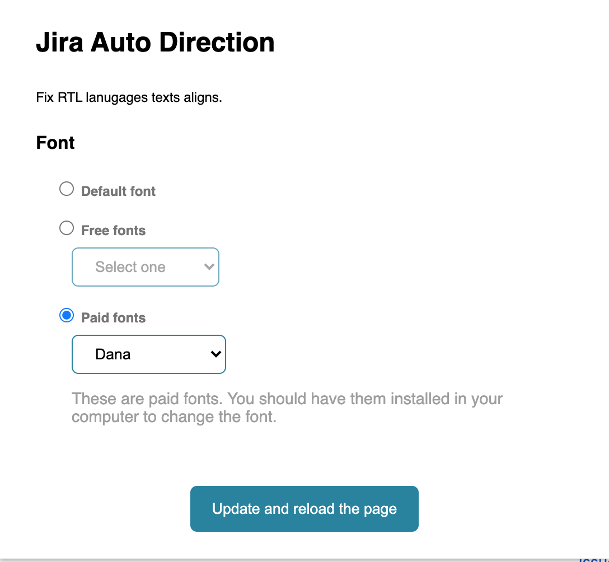

# Jira Auto Direction

This is an extension to set dir="auto" in content wrappers to make them right-aligned when the language is an RTL language (like Persian, Arabic, ...).

Also, there is an option to choose the font family and you can change the content fonts.

There are two types of fonts:

* ### **Free fonts**
 
    These fonts are free and there is no need to have them installed on your computer and they will be added automatically to the page.

    Currently, these free fonts are available:

    * Vazir (Persian and Arabic)
    * Shabnam (Persian and Arabic)
    * Harmattan (Arabic)
    * Tajawal (Arabic)
    * Rubik (Hebrew)

* ### **Paid fonts**

    Because these are paid fonts, We cannot add them and you should have them installed on your computer to use them.
    
    Currently, these paid fonts are available:

    * IRANSans (Persian and Arabic)
    * IranYekan (Persian and Arabic)
    * Dana (Persian and Arabic)
